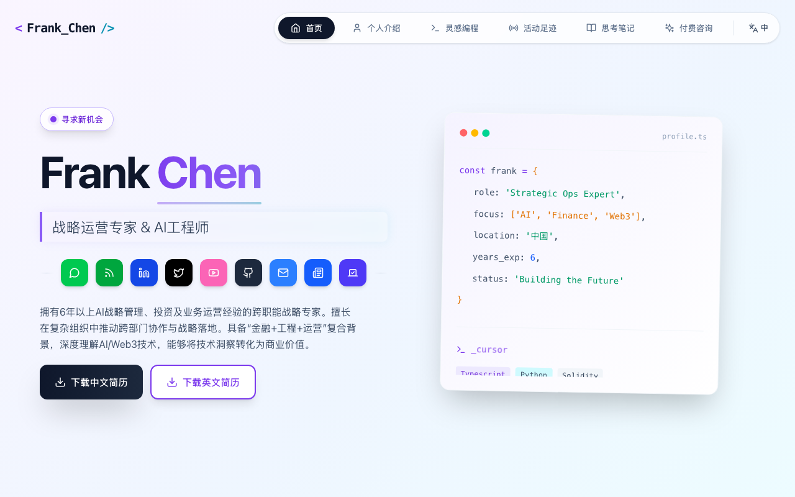
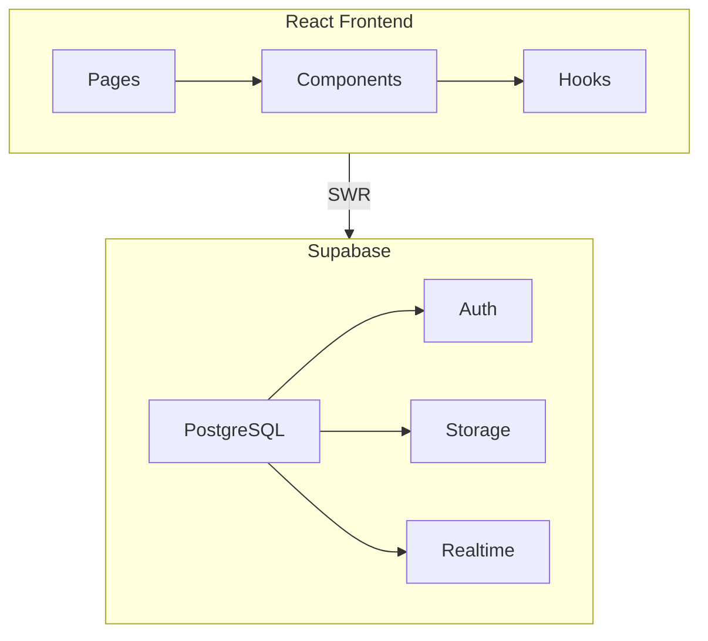

<div align="center">

# Frankfika
> 个人作品集与内容管理平台 · Personal Portfolio & CMS


AI 从业者的战略运营平台 · 集公开作品集与管理后台于一体

__简体中文__ | [English](./README_EN.md)

---
</div>

## 项目简介

**Frankfika** 是一个现代化的个人作品集网站与内容管理系统，专为 AI 和科技从业者设计。它不仅提供了精美的公开作品集展示页面，还配备了功能完善的后台管理系统，支持实时内容更新。

通过 Supabase 提供的免费数据库和认证服务，实现了零成本部署的专业级个人品牌展示方案。

## 🌟 核心功能

### 前台展示

- **🌏 多语言支持**：完整的中英文双语切换
- **👤 个人档案**：展示个人信息、技能、经历
- **📅 活动时间线**：动态记录参加的会议、社区活动、媒体采访等
- **💼 项目作品集**：展示完成的各类项目
- **📊 技能可视化**：交互式图表展示专业能力
- **📝 思考/博客**：发布技术文章和个人见解
- **🎮 Vibe Coding**：编程活动仪表盘
- **📱 响应式设计**：完美适配移动端和桌面端

### 后台管理

- **✏️ 完整 CRUD**：所有内容板块的增删改查
- **⚡ 实时更新**：修改即时生效，无需重新部署
- **🖼️ 图片上传**：支持拖拽上传至 Supabase Storage
- **🎬 视频集成**：添加视频内容展示
- **🏷️ 内容分类**：标签系统与内容组织
- **🔐 安全认证**：基于 Supabase Auth 的登录保护
- **🌐 多语言内容**：分别管理中英文内容

## 📸 界面导览

| 首页展示 | 后台管理 | 活动时间线 |
|:---:|:---:|:---:|
|  |  |  |

| 项目作品 | 技能图表 | 博客文章 |
|:---:|:---:|:---:|
|  |  |  |

## 🏗️ 技术架构



### 技术栈

| 类别 | 技术 |
|------|------|
| **前端框架** | React 18.3 + TypeScript |
| **构建工具** | Vite 6.2 |
| **UI 框架** | Tailwind CSS 4.1 |
| **路由** | React Router DOM 6.30 |
| **数据获取** | SWR 2.3 |
| **数据库** | Supabase PostgreSQL |
| **认证** | Supabase Auth |
| **存储** | Supabase Storage |
| **图表** | Recharts 2.12 |
| **图标** | Lucide React |

## 🚀 快速开始

### 前置要求

- Node.js >= 18
- Supabase 账号（免费）

### 安装步骤

```bash
# 1. 克隆项目
git clone https://github.com/your-username/Frankfika.git
cd Frankfika

# 2. 安装依赖
npm install

# 3. 配置环境变量
cp .env.example .env.local
# 编辑 .env.local，填入 Supabase 配置
```

### 环境配置

```env
# .env.local
VITE_SUPABASE_URL=your_supabase_url
VITE_SUPABASE_ANON_KEY=your_supabase_anon_key
```

### 运行项目

```bash
# 开发模式
npm run dev

# 构建生产版本
npm run build

# 预览生产构建
npm run preview
```

## 📁 目录结构

```
Frankfika/
├── src/
│   ├── admin/              # 后台管理系统
│   │   ├── components/    # 管理组件
│   │   └── pages/         # 管理页面
│   ├── components/         # 前台展示组件
│   ├── hooks/             # 自定义 Hooks
│   ├── lib/               # 工具函数和 Supabase 客户端
│   ├── types.ts           # TypeScript 类型定义
│   ├── constants.ts       # 常量配置
│   ├── App.tsx            # 主应用组件
│   └── AppRouter.tsx      # 路由配置
├── public/                # 静态资源
│   └── resume/           # 简历 PDF
├── supabase/             # 数据库迁移和种子数据
├── docs/                 # 文档
│   ├── 快速开始.md
│   ├── ADMIN_SYSTEM_README.md
│   └── SUPABASE_SETUP.md
└── .env.local            # 环境变量
```

## 📖 详细文档

| 文档 | 说明 |
|------|------|
| [快速开始](./docs/快速开始.md) | 项目启动指南 |
| [后台系统说明](./docs/ADMIN_SYSTEM_README.md) | 管理后台使用文档 |
| [Supabase 配置](./docs/SUPABASE_SETUP.md) | 数据库配置步骤 |
| [启动说明](./docs/启动说明.md) | 本地部署指南 |

## 🔧 部署指南

### Vercel 部署（推荐）

1. Fork 本仓库
2. 在 Vercel 中导入项目
3. 配置环境变量
4. 自动部署完成

### 手动部署

```bash
# 构建
npm run build

# dist 目录可部署到任何静态托管服务
```

## 🎯 使用场景

- **个人品牌建设**：展示专业能力和项目经验
- **求职展示**：向潜在雇主展示作品
- **内容管理**：统一管理各类创作内容
- **活动记录**：记录和展示参与的各类活动

## 🤝 贡献

欢迎提交 Issue 和 Pull Request！

## 📄 许可证

MIT License - 详见 [LICENSE](./LICENSE)

---

<div align="center">

**打造你的专属 AI 从业者作品集 ✨**

Copyright © 2024 Frankfika

</div>
